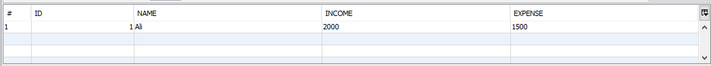
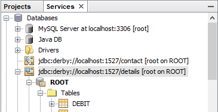
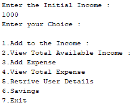

# java-rmi-example-with-DB
This is a Menu Driven Program with Implementation of RMI with Database in Java

First Add the Database in Neatbeans using JAVA DB:

Database : details
Table Name:debit.
Structure:-->

MyServer Folder is a Netbean Version of this Project.

Goto the Project Folder:
(Navigate to \MyServer\build\classes using cmd and fire the command)
Step 1:
Point the RMI Server file using this command:

>rmic AdderRemote

then Start the Server.

>rmiregistry

Step 2:

Open the MyServer Folder in Netbeans.

Create the DB ->
Goto Services.(Refer the Image)

 

Now Right click on the db and click on connect.

Run->MyServer.java

Run->MyClient.java

 This is the output of MyClient.java  

